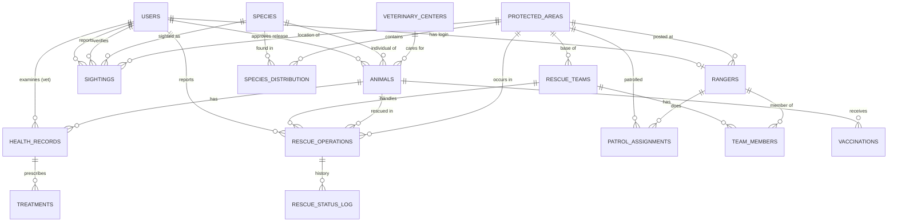
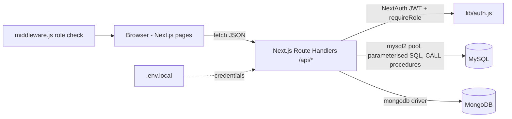

# Project Ark – Technical Documentation

> Sections for problem statement, objectives, scope and functional requirements are in the project proposal PDF (update the SQL database from PostgreSQL to MySQL there). This file covers the database design, implementation, architecture and testing.

## 1. ER diagram

(Paste into https://mermaid.live to export as PNG for the report.)

## 2. Relational schema (PK underlined as `PK`, FK marked)

- users(**user_id** PK, full_name, email UNIQUE, password_hash, role, phone, is_active, created_at)
- species(**species_id** PK, common_name, scientific_name UNIQUE, category, habitat_type, conservation_status, estimated_population, description, updated_at)
- protected_areas(**area_id** PK, name UNIQUE, area_type, state, area_sq_km, established_year)
- species_distribution(**species_id** FK, **area_id** FK, population_count, last_census) — composite PK
- rangers(**ranger_id** PK, user_id FK UNIQUE, full_name, rank_title, area_id FK, phone)
- veterinary_centers(**center_id** PK, name, location, capacity, contact)
- rescue_teams(**team_id** PK, team_name UNIQUE, base_area_id FK, is_available, vehicle_no UNIQUE)
- team_members(**team_id** FK, **ranger_id** FK, role_in_team) — composite PK
- patrol_assignments(**patrol_id** PK, ranger_id FK, area_id FK, patrol_date, shift, remarks) — UNIQUE(ranger_id, patrol_date, shift)
- animals(**animal_id** PK, species_id FK, tag_code UNIQUE, sex, est_age_years, center_id FK, status, release_approved_by FK)
- sightings(**sighting_id** PK, species_id FK, area_id FK, reported_by FK, latitude, longitude, sighted_at, count_seen, is_verified, verified_by FK, mongo_report_id)
- rescue_operations(**rescue_id** PK, animal_id FK, species_id FK, area_id FK, reported_by FK, team_id FK, priority, status, description, reported_at, closed_at, mongo_doc_id)
- rescue_status_log(**log_id** PK, rescue_id FK, old_status, new_status, changed_at)
- health_records(**record_id** PK, animal_id FK, vet_id FK, exam_date, diagnosis, weight_kg, condition_level)
- treatments(**treatment_id** PK, record_id FK, medication, dosage, start_date, end_date)
- vaccinations(**vaccination_id** PK, animal_id FK, vaccine_name, given_on, next_due)
- audit_log(**audit_id** PK, table_name, record_id, action, details, logged_at)

All tables are in 3NF: every non-key attribute depends only on the whole key; M:N relationships (species–area, team–ranger) are resolved into junction tables.

## 3. Data dictionary (key constraints)

| Table.column | Type | Constraint / rule |
|---|---|---|
| users.email | VARCHAR(120) | NOT NULL, UNIQUE, CHECK email pattern |
| users.role | ENUM | ADMIN, FOREST_OFFICER, RESEARCHER, VET_OFFICER |
| users.password_hash | VARCHAR(255) | bcrypt hash only, never plain text |
| species.conservation_status | ENUM | IUCN codes LC, NT, VU, EN, CR, EW, EX |
| species.estimated_population | INT | CHECK ≥ 0 |
| protected_areas.area_sq_km | DECIMAL | CHECK > 0 |
| sightings.latitude / longitude | DECIMAL(9,6) | CHECK −90..90 / −180..180 |
| sightings.count_seen | INT | CHECK > 0 |
| rescue_operations.status | ENUM | REPORTED → APPROVED → ASSIGNED → IN_PROGRESS → COMPLETED / CANCELLED |
| rescue_operations.closed_at | TIMESTAMP | CHECK closed_at ≥ reported_at |
| animals.status | ENUM | WILD, IN_RESCUE, UNDER_TREATMENT, REHABILITATING, RELEASED, DECEASED |
| health_records.condition_level | ENUM | CRITICAL … FIT_FOR_RELEASE |
| treatments.end_date | DATE | CHECK end_date ≥ start_date |
| veterinary_centers.capacity | INT | CHECK > 0, enforced by trigger on admission |
| patrol_assignments | – | UNIQUE(ranger, date, shift): no double booking |

Referential actions: CASCADE for dependent rows (distribution, team members, health records), SET NULL where history must survive (animal's center, rescue's team).

## 4. Database choice and justification

**MySQL** holds data that is structured, related and must stay consistent: users and roles, species, areas, the rescue workflow, animal health. These need foreign keys, ACID transactions (assigning a team must never double-book), triggers for business rules, and joins/aggregates for reports.

**MongoDB** holds field data whose shape varies from record to record: field reports with optional photos and weather, camera-trap captures with a variable list of detections, habitat surveys whose metrics differ per survey, and a growing timeline of rescue notes. Forcing these into tables would mean many nullable columns or EAV tables. MongoDB gives flexible documents, `$jsonSchema` validation, text search, geospatial (`2dsphere`) queries and aggregation pipelines.

**Linking:** Mongo documents store MySQL ids (`species_id`, `area_id`, `sighting_id`, `rescue_id`); MySQL stores the Mongo `_id` in `sightings.mongo_report_id`. The sighting API writes both inside a MySQL transaction and rolls back / deletes the Mongo document if either write fails.

## 5. MongoDB data model

| Collection | Purpose | Validation | Indexes |
|---|---|---|---|
| field_reports | Sighting / incident / behaviour notes, photos metadata, GeoJSON point | type enum, required ids, GeoJSON shape, notes min length | 2dsphere(location), {species_id, observed_at}, text(notes, tags) |
| camera_traps | Trap captures with detections array + image metadata | detections items require species_id, count ≥ 1, confidence 0–1 | {area_id, captured_at}, multikey detections.species_id |
| research_notes | Journals, habitat surveys (free-form `survey` object), behaviour logs | kind enum, title/body length | weighted text(title×5, tags×3, body), {kind, created_at} |
| rescue_docs | Timeline of notes per MySQL rescue | rescue_id required | unique rescue_id |

Retrieval: text search ranked by `textScore`; geo `$near` within radius; aggregation pipelines (`$unwind` → `$group` → `$sort`) for camera-trap detections and report counts on the dashboard.

## 6. Advanced features implemented (requirement: at least 4)

| Feature | Where |
|---|---|
| Transactions | `sp_assign_rescue_team`, `sp_close_rescue` (with `FOR UPDATE` locks + rollback); app: `/api/health`, `/api/sightings` |
| Triggers (5) | status log + auto close; release rules; vet-only health records; species audit; vet-center capacity |
| Stored procedures (3) / function (1) | `sp_assign_rescue_team`, `sp_close_rescue`, `sp_area_species_report`, `fn_avg_rescue_hours` |
| Views (5) | `v_rescue_stats`, `v_species_population`, `v_monthly_sightings`, `v_animals_in_care`, `v_top_species_per_area` |
| Indexing | composite B-tree indexes + `EXPLAIN` demo |
| Full-text search | MySQL FULLTEXT on species; MongoDB weighted text index on research notes |
| NoSQL aggregation | camera-trap and field-report pipelines on dashboard |
| Geospatial query | `2dsphere` + `$near` on field reports |
| Window functions / CTE | `RANK() OVER`, running total with `WITH` |

## 7. System architecture

Security: bcrypt password hashes, JWT sessions (8 h), role checks both on pages (middleware) and on every API route, parameterised queries only, credentials only in `.env.local` (git-ignored), database-level CHECK constraints, triggers and Mongo validators so bad data is rejected even if the UI is bypassed.

## 8. Role permissions

| Action | Admin | Forest officer | Researcher | Vet officer |
|---|---|---|---|---|
| Manage users, add species, change status | ✔ | | | |
| Report / verify sightings | ✔ | ✔ | report only | |
| Delete unverified sightings | ✔ | | | |
| Report rescue, assign team, close | ✔ | ✔ | | |
| Approve rescue | ✔ | | | |
| Health records, approve release | (blocked by trigger) | | | ✔ |
| Research notes | ✔ | | ✔ | |
| Dashboard, species, research view | ✔ | ✔ | ✔ | ✔ |

## 9. Test cases

| # | Test | Expected | Enforced by |
|---|---|---|---|
| 1 | Login with wrong password | "Email or password is incorrect" | bcrypt compare |
| 2 | Researcher opens /rescues | Redirected to dashboard with "Your role cannot open that page" | middleware |
| 3 | Report sighting with latitude 120 | Error: check constraint violated | CHECK |
| 4 | Assign a busy team | "Team not available", no change | sp_assign_rescue_team |
| 5 | Assign team to a REPORTED rescue | "Rescue must be APPROVED before assignment" | procedure |
| 6 | Change rescue status | Row appears in status log | trigger |
| 7 | Close rescue with center | Animal UNDER_TREATMENT at center, team freed | procedure + trigger |
| 8 | Admin adds health record | "Only veterinary officers can add health records" | trigger |
| 9 | Release without fit exam | "Latest health exam is not FIT_FOR_RELEASE" | trigger |
| 10 | Admin approves release | "Release requires veterinary approval" | trigger |
| 11 | Vet releases after FIT exam | Status RELEASED, center cleared | trigger |
| 12 | Change species CR → EN | audit_log row added | trigger |
| 13 | Admit animal to full center | "Veterinary center is at full capacity" | trigger |
| 14 | Invalid survey JSON / bad Mongo doc | Rejected with validation message | API + $jsonSchema |
| 15 | Duplicate species scientific name | Duplicate entry error | UNIQUE |
| 16 | Delete verified sighting | "Only unverified sightings can be deleted" | API rule |
| 17 | Search species "tiger" | Bengal Tiger ranked first | FULLTEXT |
| 18 | Search notes "invasive lantana" | Bandipur survey first with relevance score | Mongo text index |

Record screenshots of each for the report's "Testing results" section.

## 10. Conclusion and future enhancements
Project Ark shows how a relational database and a document database can each take the data they suit best while staying linked and consistent. Future work: vector search over research notes for semantic similarity, real map view of sightings, photo upload to object storage, offline field entry, and SMS alerts for critical rescues.
